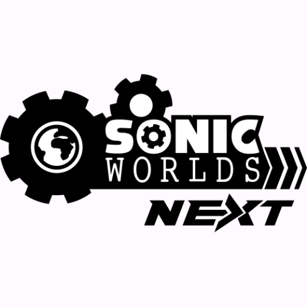

***PLEASE PLEASE PLEASE! Before you submit a Pull Request to this repository, post about what you want to submit in [Discussions](https://github.com/Techokami/SonicWorldsNext/discussions) first! PLEASE!***

# Sonic Worlds Next

This is the official development repository for the successor to Sonic Worlds Delta.

This uses [Godot 4](https://godotengine.org/) to implement a 2D Sonic the Hedgehog-like framework, intended for use in creating fangame projects and original game projects. Godot 4 support will be prioritized once it has reached stable status. Like Godot, the code within this repository is provided under the MIT License.
 if you use godot 3 use the [Godot 3 Branch here](https://godotengine.org/).

Found a problem with the code? Please use the Issues tab! But see if it hasn't been reported yet to prevent duplicate reports.

Want to discuss the project and ask questions? Please use the [Discussions](https://github.com/Techokami/SonicWorldsNext/discussions) tab, or ask in the official threads on SFGHQ or Sonic Retro.
